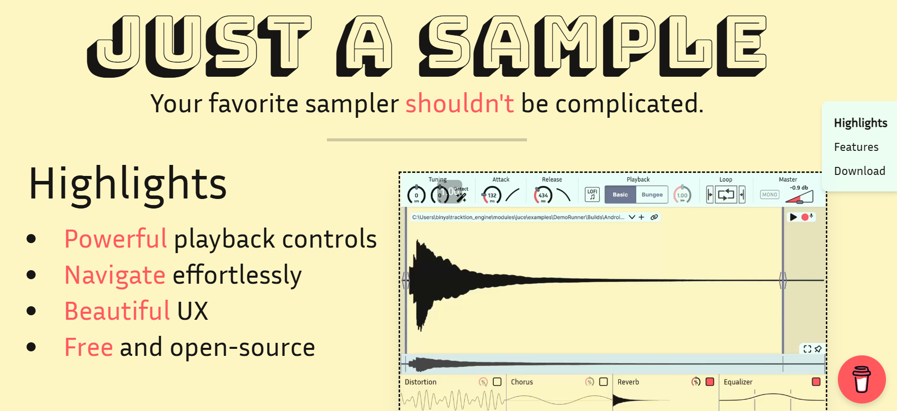

## Description
This is the source code for the landing page of [Just a Sample](https://github.com/bobona/just-a-sample).
It is a simple single page Astro app that uses Tailwind CSS for styling. See it live on GitHub Pages [here](https://bobona.github.io/just-a-sample/).

Feel free to use this code as a template for your own projects.
